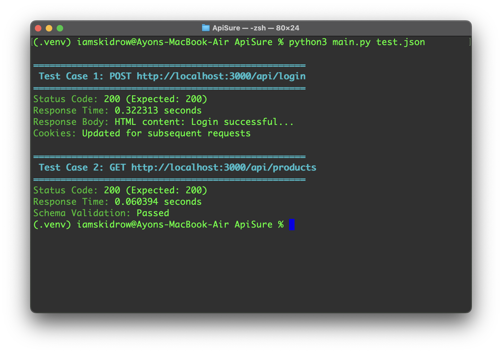
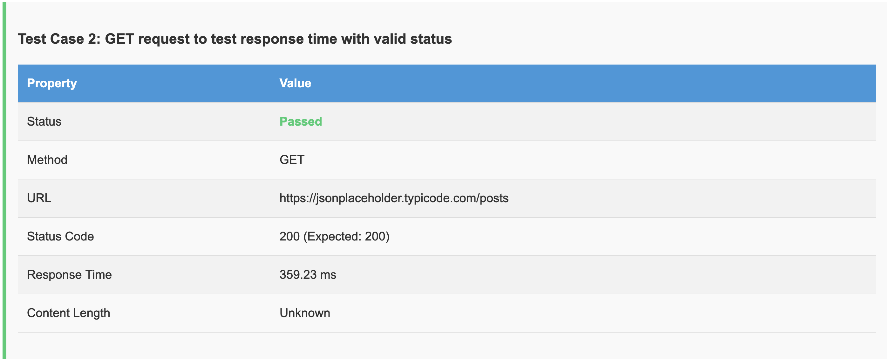
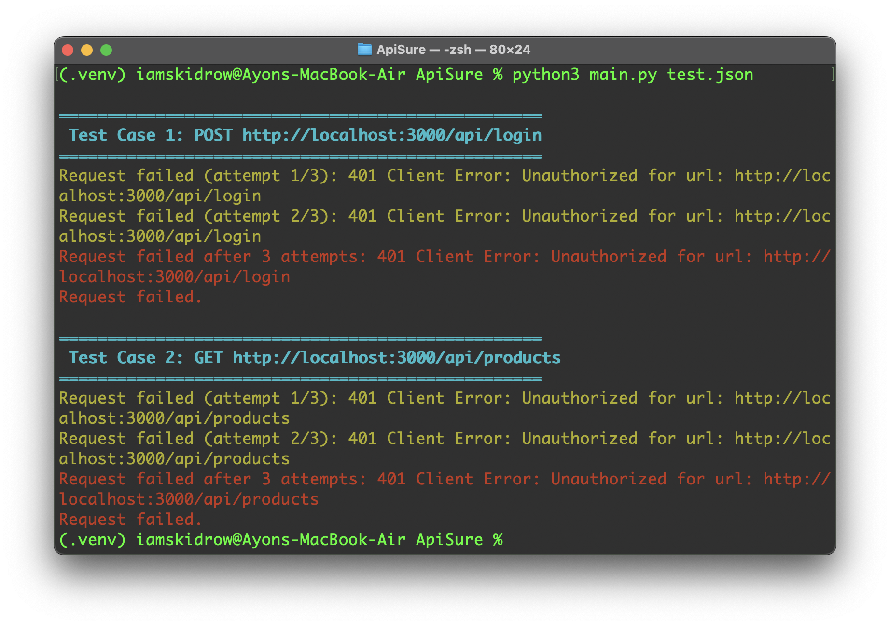
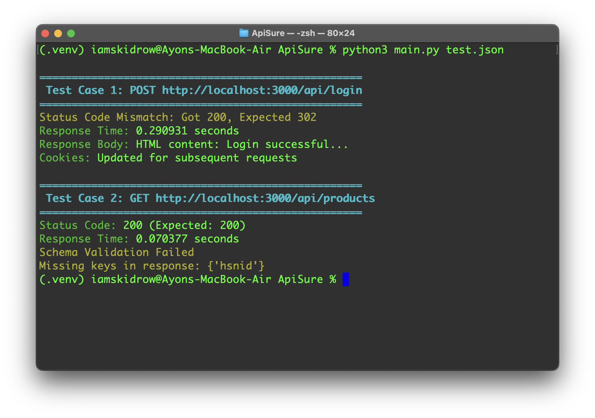
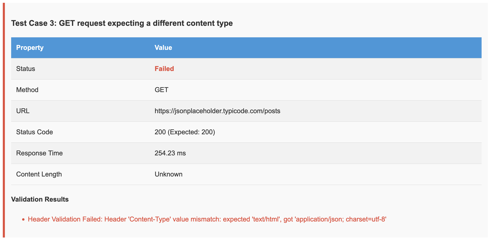
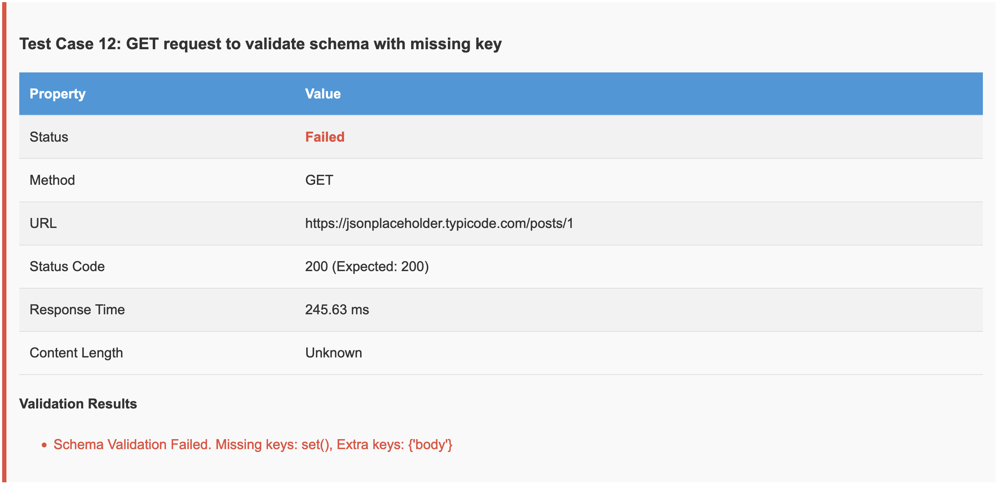
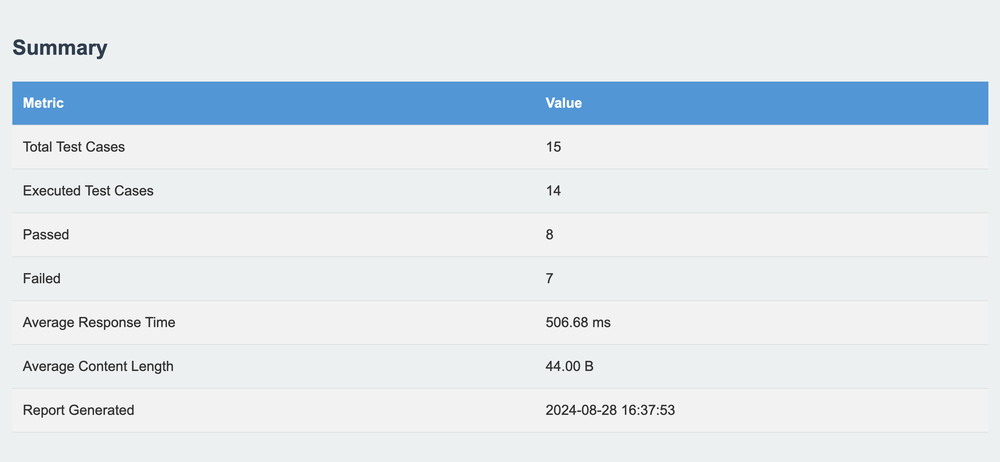

# ApiSure

ApiSure is a lightweight API testing tool that will automate endpoint validation. It supports schema checks, response
time monitoring, and detailed output—all of the features you may want to ensure API reliability. It integrates easily
into CI/CD pipelines, so you get a seamless way to maintain and verify API standards.

# Usage

To use ApiSure, follow these steps:

1. **Install Dependencies**:
   Ensure that all required Python packages are installed:
   ```bash
   pip3 install -r requirements.txt
   ```

2. **Prepare Test Cases**:
   Define your API test cases in a JSON file. Refer to the API Test Case Structure Breakdown for the required and
   optional fields.

3. **Run the Tests**:
   Execute the tests using the following command:
   ```bash
   python3 main.py tests.json
   ```

4. **View the Results**:
   After execution, a summary will be displayed in the terminal. Additionally, an HTML report will be generated with
   detailed test results, including any validation errors and performance metrics

# Screenshots

### OK Response

Shows a successful API response with the expected status code and schema validation.




### Unauthorized Response

Displays an API response indicating unauthorized access, highlighting authentication issues.



### Validation Error

Illustrates a response that failed schema validation, pinpointing discrepancies in the response structure.




### Schema Error

Displays a response that failed schema validation, highlighting discrepancies between the expected and actual schema.



### Summary

Presents a summary of the test results, including the number of passed and failed cases, along with performance metrics
like average response time.


# API Test Case Structure Breakdown

This document outlines the required and optional fields for defining API test cases. Each field is categorized as either
required or optional, with default values provided where applicable.

## Example JSON Structure

```json
[
  {
    "description": "User Login",
    "method": "POST",
    "url": "http://localhost:3000/api/login",
    "headers": {
      "Content-Type": "application/json"
    },
    "json": {
      "email": "example@example.com",
      "password": "password123"
    },
    "params": {
      "limit": 10,
      "page": 1
    },
    "expected_status": 302,
    "expected_headers": {
      "Location": "/dashboard"
    },
    "forbidden_headers": [
      "X-Powered-By"
    ],
    "expected_schema": {
      "type": "object",
      "properties": {
        "token": {
          "type": "string"
        },
        "expires_in": {
          "type": "integer"
        }
      },
      "required": [
        "token",
        "expires_in"
      ]
    },
    "expected_response": {
      "length": {
        "min": 1
      }
    },
    "expected_content": {
      "token": "some_token_value",
      "expires_in": 3600
    },
    "expected_types": {
      "token": "string",
      "expires_in": "integer"
    },
    "timeout": 5000,
    "retry_count": 3,
    "retry_delay": 1000,
    "skip": false
  }
]
```

## Required Fields

### `description`

- **Type:** String
- **Required:** Yes
- **Default Value:** None (must be provided)
- **Explanation:** A human-readable description of the test case, used to identify the purpose of the test.

### `method`

- **Type:** String (e.g., `GET`, `POST`, `PUT`, `DELETE`, `PATCH`)
- **Required:** Yes
- **Default Value:** None (must be provided)
- **Explanation:** Specifies the HTTP method to be used for the request.

### `url`

- **Type:** String (URL format)
- **Required:** Yes
- **Default Value:** None (must be provided)
- **Explanation:** The endpoint to which the request will be sent.

## Optional Fields

### `headers`

- **Type:** Object (Key-value pairs)
- **Required:** No
- **Default Value:** `{}` (an empty object)
- **Explanation:** Specifies any headers to include with the request, such as `Content-Type`, `Authorization`, etc.

### `json`

- **Type:** Object (Key-value pairs)
- **Required:** No
- **Default Value:** None
- **Explanation:** The JSON body to be sent with the request, typically used with `POST` or `PUT` requests. If not
  provided, no JSON body will be sent.

### `params`

- **Type:** Object (Key-value pairs)
- **Required:** No
- **Default Value:** None
- **Explanation:** Query parameters to be appended to the URL, typically used with `GET` requests. If not provided, no
  query parameters are added.

### `expected_status`

- **Type:** Integer (HTTP status code)
- **Required:** No
- **Default Value:** None
- **Explanation:** The expected HTTP status code. If not provided, status code validation is not performed.

### `expected_headers`

- **Type:** Object (Key-value pairs)
- **Required:** No
- **Default Value:** None
- **Explanation:** Specifies headers expected in the response. If not provided, response header validation is not
  performed.

### `expected_schema`

- **Type:** Object (JSON Schema format)
- **Required:** No
- **Default Value:** None
- **Explanation:** Defines the expected structure of the JSON response. If not provided, schema validation is not
  performed.

### `expected_response`

- **Type:** Object (Key-value pairs for custom validation)
- **Required:** No
- **Default Value:** None
- **Explanation:** Custom checks for response content, such as the minimum length of an array. If not provided, custom
  content validation is not performed.

### `timeout`

- **Type:** Integer (milliseconds)
- **Required:** No
- **Default Value:** 5000 (5 seconds)
- **Explanation:** Specifies the maximum time to wait for a response. If not provided, the default value of 5000ms is
  used.

### `retry_count`

- **Type:** Integer
- **Required:** No
- **Default Value:** 3
- **Explanation:** The number of retry attempts if the request fails. If not provided, it defaults to 3 retries.

### `retry_delay`

- **Type:** Integer (milliseconds)
- **Required:** No
- **Default Value:** 1000 (1 second)
- **Explanation:** The delay between retry attempts. If not provided, the default value of 1000ms is used.

### `skip`

- **Type:** Boolean
- **Required:** No
- **Default Value:** `false`
- **Explanation:** Indicates whether to skip this test case. If not provided, the test will be executed.
